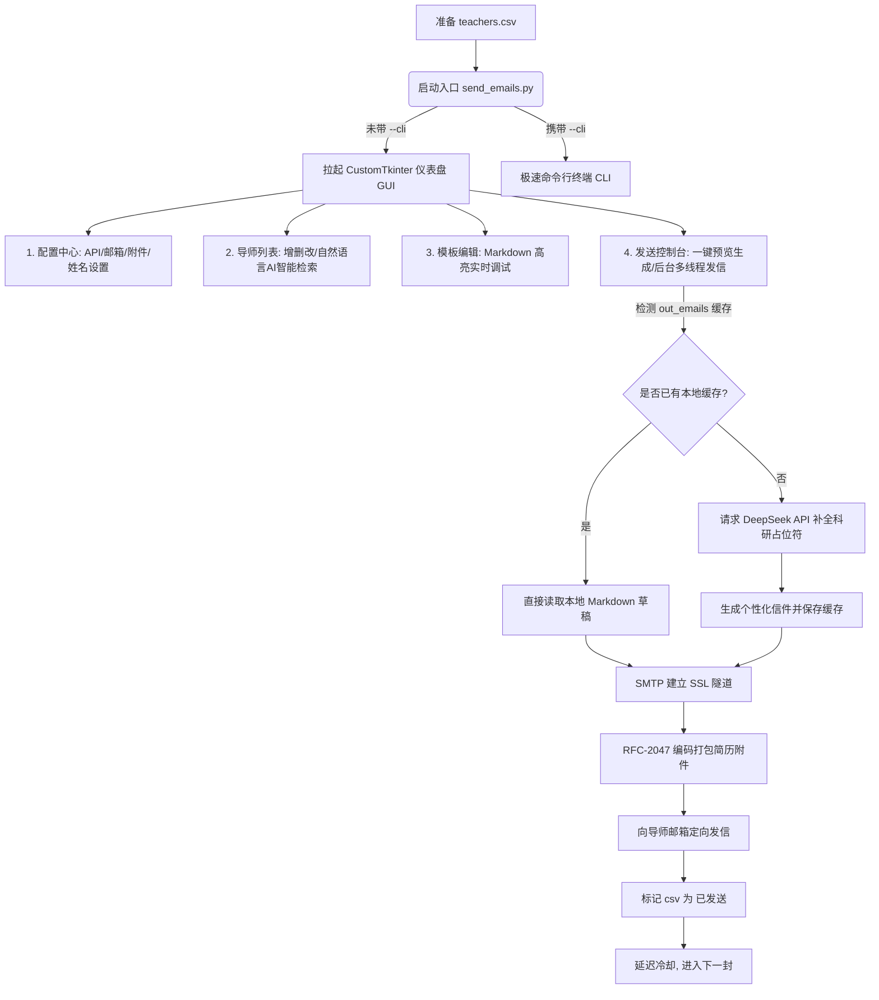

# 🎓 Academix-Sender: 保研/考研联系导师自适应学术发信系统

<p align="center">
  
  
  
  
</p>

**Academix-Sender** 是一款专为高校学生设计的**学术自适应批量邮件发送系统**。旨在解决在推免保研、考研复试自荐或申请实验室导师时，传统群发邮件缺乏诚意、效率低下、容易出错的痛点。

本系统深度融入了 **DeepSeek 大语言模型** 的背景分析与常识推理能力，同时结合了 **SMTP 服务** 与现代化自适应 GUI 界面。它能根据导师的研究方向与公开成果，智能匹配并填入您的自荐信占位符，生成独一无二、针对性极强的“千人千信”邮件，极大提高联系导师的面试通过率！

---

## ✨ 核心亮点与特色

- 🌟 **大模型智能匹配**：自动将每位导师的信息（姓名、学院、研究方向）提交给 DeepSeek API，动态总结出该导师的核心学术方向与代表项目，并无缝组装填入您的自荐信模板中。
- 🎨 **极佳视觉体验**：基于 `CustomTkinter` 框架倾心打造的现代化 GUI 仪表盘，支持系统自适应深色/浅色皮肤，扁平化学术蓝配色，布局优雅。
- 🤖 **AI 自动导师寻录 (GUI 特色)**：在“导师管理”中，只需输入一句自然语言（如 `清华大学自动化系周东华`），系统会自动在后台检索导师成果、推理其官方邮箱、研究成果大纲并自动追加至表格中。
- 🛡️ **安全隔离与机制防护**：
  - **防泄密**：已全面支持 `.gitignore` 规则，自动忽略您的 `.env`（内含 API KEY 与邮箱授权码）及 `teachers.csv`（您的私人导师名册），放心开源，毫无后顾之忧。
  - **断点增量续发**：实时在 CSV 中标记并保存已发送状态，下次启动直接跳过已发送名单，彻底拒绝重复打扰导师。
  - **发信频控冷却**：内置发信时间延迟冷却保护算法（默认6秒），模拟人工行为，保障您的发信邮箱不被系统拦截。
  - **附件防乱码编码**：采用国际最主流的 RFC-2047 格式对简历附件名编码，防止在各类邮件客户端中文件名中文乱码。
- ⚡ **本地缓存发信 (极度省钱)**：支持“一键本地预览生成”，直接在本地导出 `.md` 格式邮件草稿。发信时系统会**优先检索本地缓存**而不再重复调用大模型，不仅可供您手动校验，更能为您省下大量的 Token 费用！

---

## 🛠️ 核心架构流程



---

## 🚀 快速开始

### 1. 克隆与安装依赖
首先，克隆项目至您的本地，并安装所需库：
```bash
git clone https://github.com/your-username/Academix-Sender.git
cd Academix-Sender
pip install -r requirements.txt
```

### 2. 配置密钥信息
复制项目下的配置文件模板并重命名为 `.env`：
```bash
cp .env.example .env
```
用编辑器打开 `.env` 并填写对应的值：
- `DEEPSEEK_API_KEY`: 大模型 API 密钥（注册即送高额免费额度）。
- `SMTP_USER`: 您的发件人邮箱地址。
- `SMTP_PASS`: 邮箱 SMTP 服务的独立授权码（注意：不是您的邮箱登录密码，请登录邮箱官网 -> 设置 -> 开启 SMTP 独立获取）。
- `SENDER_NAME`/`SENDER_UNIVERSITY`: 您的姓名与高校，用来自动拼装标题。

### 3. 配置自荐信与名单
1. **导师名单**：在 Excel 中打开并填写 `teachers.csv`，表头保留为 `姓名,学校,学院,邮箱,研究方向简述,状态`；或者稍后直接在 GUI 可视化网格中手动添加与AI检索。
2. **简历附件**：把您的简历 PDF 文件放入同级目录，并在 `.env` 的 `DEFAULT_ATTACHMENT_PATH` 中修改为该文件名（如 `my_resume.pdf`）。
3. **自荐信模板**：编辑 `模板.md`，信中包含了用于让大模型识别定位的 `XXX` 占位符标识，**请勿删除这些特定语句（详见模板顶部说明）**，其余的个人成绩及经历可根据个人情况充分润色。

### 4. 运行发信
直接运行统一入口脚本：
```bash
python send_emails.py
```
> **提示**：若在无界面系统、远程 VPS 服务器或本地界面渲染异常的情况下，可运行 CLI 终端模式：
> ```bash
> python send_emails.py --cli
> ```

---

## 📄 开源许可证

本项目基于 [MIT License](LICENSE) 许可协议开源。您可以自由修改、商用，但请保留版权声明。

祝各位同学推免保研顺利，科研长青，前程似锦！🌟
